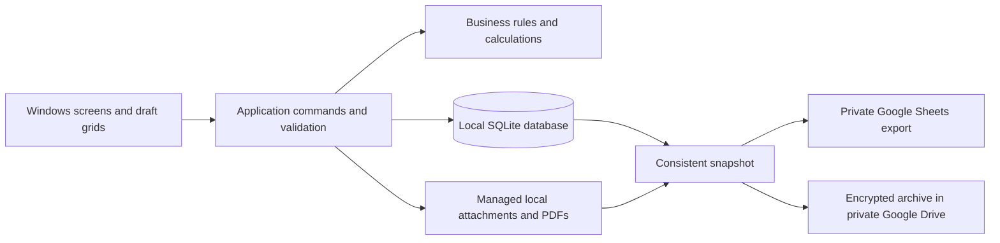

# Application Architecture

Status: The desktop shell, welcome screen, and first TEST database initialization are implemented. A saved Store ID survives closing and reopening the app on the development computer. An earlier welcome-screen preview launched on the Surface Pro 7; the storage additions still need Surface testing. The business architecture below remains planned. Dependency licenses, authentication, recovery, and deployment choices require the checks listed in the [implementation plan](implementation-plan.md).

## Current project

The [desktop project](../src/SarahBeauty.Desktop/SarahBeauty.Desktop.csproj) is the only application project currently present. `App.xaml.cs` starts the application, `MainWindow.xaml` provides the window and page frame, and `MainPage.xaml` contains the welcome screen. Its code-behind calls `Storage/LocalDatabase.cs` to initialize the TEST database and display its path and Store ID. Cloud integration and business workflows are not connected.

`Storage/AppDataPaths.cs` resolves the current Windows user's local application data directory and creates `SarahBeautyDesktop/Test` beneath it. `LocalDatabase` opens `sarahbeauty.db` with `ReadWriteCreate` and requests foreign-key enforcement on that connection. In one transaction it creates `AppMetadata` if missing, inserts a generated Store ID only if that key is absent, and reads the saved value. SQL parameters carry the candidate ID; restarting the app preserves an existing ID. `MainPage` catches initialization errors and displays them in the development preview.

The development launch profile uses `commandName: Project`, and the project sets `WindowsPackageType` to `None`. `RunWorkingDirectory` points to the project directory for the relative icon path. This uses an unpackaged development launch, consistent with the folder-based Surface preview. The generated MSIX tooling remains in the project; a packaged release and its data location are not established by this milestone.

The generated project targets `net10.0-windows10.0.26100.0` and declares these package versions:

| Package | Version |
|---|---|
| Microsoft.Data.Sqlite | 10.0.12 |
| Microsoft.WindowsAppSDK | 2.5.1 |
| Microsoft.Windows.SDK.BuildTools | 10.0.28000.2705 |
| Microsoft.Windows.SDK.BuildTools.WinApp | 0.6.1 |

These values record the current project configuration. The earlier unpackaged, self-contained `win-x64` welcome-screen preview was manually launched on the Surface Pro 7 with Windows 11 Pro 25H2, build 26200.9457. That test predates the SQLite addition; it does not establish current storage behavior on the Surface. Update this table when dependency versions change.

## Platform and boundaries

Use C#/.NET with WinUI 3 for the Windows interface and SQLite for the local database. WinUI 3 supports Windows 10 version 1809 and later, including Windows 11, but the chosen .NET/Windows App SDK versions may add requirements. The current preview has launched on the actual Surface; support for other Windows versions is not established. See [Microsoft's WinUI 3 documentation](https://learn.microsoft.com/en-us/windows/apps/winui/winui3/).

The desktop database is authoritative. Google integrations export snapshots; they do not post transactions or synchronize competing edits. There is no public web server, phone app, or network listener for business records in this release.

## Code organization

| Planned project | Responsibility |
|---|---|
| Desktop | WinUI views, view models, navigation, owner context, accessibility, file pickers |
| Core | Money/quantity types, validation, booking rules, accounting rules, report contracts |
| Application | Save/approve/issue/reverse/reconcile/close commands and workflow orchestration |
| Infrastructure | SQLite persistence/migrations, local files, PDF output, backup, Google authorization/APIs |
| Tests | Rule examples, database integration, failure/retry, document privacy, backup/restore verification |

Screens call commands rather than writing journal rows directly. Core calculations have no dependency on WinUI, Google, or a network connection. The same commands serve forms and draft grids. Add interfaces at persistence/document/backup boundaries where tests need realistic failure behavior, not around every class.

## Local storage

The current implementation is TEST-only and has one technical table, `AppMetadata`. SQLite's `user_version` is still `0`; schema migrations, stored mode validation, business identity, managed attachments, and local recovery snapshots remain planned. The saved Store ID identifies this database and is separate from the future business record. The following requirements govern the remaining implementation.

- Keep source code and business data in separate directories. A database must never default to the repository root or a cloud-synchronized live folder.
- Both owners will use one Windows profile on the Surface. Resolve the current user's local application data directory at runtime; the current test store is `SarahBeautyDesktop/Test` beneath it. The effective development path and Store ID persistence have been checked. Verify storage in the published Surface build before enabling live records.
- Separate TEST and LIVE stores, managed attachment directories, and local backup staging. Store schema version and business identity in each database.
- Enable and verify SQLite foreign-key enforcement on every connection. Use transactions, bounded busy handling, parameterized SQL, and database uniqueness/check constraints.
- Use schema migrations with a verified recovery snapshot before an upgrade. Reject unsupported newer schemas without modifying them.
- Copy an attachment to a staging file, validate/hash it, move to its managed final location, then commit its reference. Clean unreferenced temporary files through a recoverable maintenance process.
- Treat attachments as immutable once referenced by issued/posted evidence. Retain old versions through linked replacements and retention rules.

## Posting one financial draft

1. Read the draft's ID and revision, active owner identity, business/mode, and approval action.
2. Begin a database transaction. Re-read the draft and dependent balances within it.
3. Check idempotency, references, dates, source evidence, classification, closed periods, source/target amount limits, and stale edits.
4. Calculate all transaction, journal, allocation, credit, and audit effects in integer cents. Validate their combined result, including dependencies at historical dates.
5. Insert one posting batch and its effects, mark the draft posted, and enqueue backup work in that same transaction.
6. Commit. Only committed records feed reports. Return the existing committed result on a retry of the same action.
7. Update the interface and process optional cloud jobs separately. Network failure cannot roll back a committed local payment.

SQLite's transaction guarantees are the basis for the all-or-nothing local write; the implementation still needs failure-injection tests. See [SQLite atomic commit](https://www.sqlite.org/atomiccommit.html).

External-payment deduplication is additional to retry identity. Namespace reliable references by provider/account; flag ambiguous date/amount/payer similarities for review. Do not reject two legitimate identical cash amounts just because they look similar.

## Documents, reports, and background work

Document issuance reserves a unique number/version and immutable data snapshot transactionally. PDF rendering may fail outside that transaction: expose Issued/PDF pending and retry the same version without issuing a new invoice. Confirm availability before presenting the file as ready.

Report queries use a consistent committed snapshot and record their data watermark. Chart data comes from the same report definitions, not independent arithmetic in UI controls.

Background jobs persist their queue state. Run one writer per business store initially; still guard double-clicks, retries, additional windows/processes, and stale drafts with database constraints. On restart, recover pending document/backup jobs without repeating financial posting.

## Privacy and owner identity

The device and Windows login are shared by two trusted owners, but each approval needs an authenticated local owner context inside the app. The app-level authentication and credential recovery mechanisms remain unresolved. Use secure credential storage and test offline identity switching and recovery before live financial approval.

Windows file permissions and available device encryption protect local storage. Plain SQLite is not automatically encrypted. Confirm the Surface's disk protection and the selected database/attachment protection before using live records. Do not describe a display-name selector or audit table as tamper-proof security.

Use the system browser for Google sign-in with the installed-application authorization flow and PKCE. Keep tokens in appropriate Windows-protected credential storage, separate from data exports and logs. Do not put a reusable confidential-client secret in a desktop executable or public repository. See [Google's desktop OAuth flow](https://developers.google.com/identity/protocols/oauth2/native-app).

Request only the needed file access. Google's `drive.file` scope provides per-file access for files created/opened with the application; verify that the chosen Sheets and Drive workflow works with it. Existing privately owned workbook access must be granted through a supported selection flow, not inferred from possession of its ID. See [Drive API scopes](https://developers.google.com/workspace/drive/api/guides/api-specific-auth).

## Scope of the design

This architecture specifies what to implement and test. It does not establish that offline authentication, encrypted recovery, Google authorization, PDF rendering, or Surface performance already work. Follow the [acceptance criteria](acceptance-criteria.md) and record actual results during implementation.
