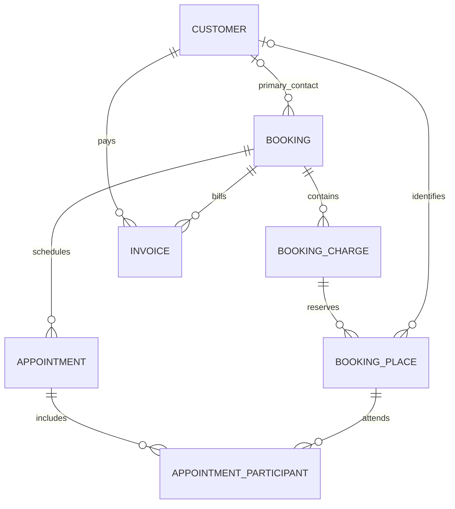

# Data Model

Status: Logical design for implementation. These are records and relationships, not an existing SQLite schema. Migrations will translate this contract into physical tables and constraints.

## Conventions

- Every table has a generated, permanent `id` (UUID), `businessId`, `createdAtUtc`, and `createdByOwnerId`. The root Business uses its own ID as `businessId`.
- Editable records also have `updatedAtUtc`, `updatedByOwnerId`, and an integer `revision` for stale-edit detection. Financial/document history uses append-only versions and linked reversals instead.
- Imported historical records can have an unknown original actor, but must retain their source and the owner who imported/reviewed them. Never invent an actor.
- `?` means optional/unknown. Other fields are required for a completed record; an incomplete draft may defer them only where its next state explicitly validates them.
- Fields ending `Id` reference the named record, and links must stay within the same business and TEST/LIVE store. Parent deletion is restricted when history references it.
- `Cents` fields are integer money; `Date` fields are calendar dates; `AtUtc` fields are UTC instants. Quantity, miles, percentage, and rate fields use fixed decimal precision, not floating-point storage. A fraction such as 0.075 means 7.5%; label percentage inputs clearly.
- Structured address means street lines, city, state/region, postal code, and country. A snapshot is a versioned structured copy, not a live foreign-key lookup.
- Computed balances, overdue flags, named counts, and dashboard totals are views, not manually editable inputs. Cache only with a committed-data watermark.

## Business, owners, and reference records

| Record | Fields in addition to shared fields | Constraints and relationships |
|---|---|---|
| Business | legalName, displayName, contactEmail?, contactPhone?, address?, ein?, currency, timezone, mode, booksStartDate?, reportingYearStart?, formationStatus, einStatus, bankSetupStatus, taxSetupStatus | Actual identifiers are private setup data; unknown statuses remain explicit. One business per working store initially. |
| BusinessSettings | businessId, documentPrefixes, defaultTrialCents, depositFraction, defaultTravelRateCents, travelOrigin?, defaultDueRules?, policyVersion, closedThroughDate? | One current version per business with change history; defaults never rewrite snapshots. |
| OwnerProfile | displayName, localIdentityReference?, active | Two initial owners; credential material is outside ordinary record fields. |
| OwnerInterest | ownerId, effectiveFrom, effectiveTo?, ownershipFraction, evidenceAttachmentId? | Effective ownership periods must not overlap inconsistently; active interests sum to 100% once confirmed. No automated cash distribution. |
| Account | code, name, accountType, normalSide, reportGroup, cashKind?, nickname?, lastFour?, activeFrom, activeTo?, openingStatus | Unique code. Types: Asset, Liability, Equity, Income, Expense. Cash kind: Cash, Bank, Processor, or None. Opening entries link to evidence; never full bank credentials. |
| Service | name, unit, currentPriceCents, defaultDurationMinutes?, active, taxReviewStatus | Person, Package, Mile, or Custom units. Prices are defaults only. |
| ServiceComponent | serviceId, name, kind, allocatedPriceCents, durationMinutes?, taxTreatmentId? | Bridal trial and wedding components share one package; component values sum to the package price for the chosen version. |
| Artist | displayName, contactPhone?, contactEmail?, rateNotes?, active | One initially; future additions supported without employment-classification assumptions. |
| Supplier | name, contactPhone?, contactEmail?, address?, paymentTerms?, privateNotes?, active | Supplier identity is distinct from a customer even if names match. |

## Customers and permission history

| Record | Fields | Constraints and relationships |
|---|---|---|
| Customer | fullName, phone?, email?, preferredContact, billingName?, billingAddress?, makeupPreferences?, sensitivities?, privateNotes?, status | Trimmed nonempty name only is sufficient. Preferred contact: Undecided, Phone, Text, Email. Status: Active, Archived. Names need not be unique. |
| CustomerPermission | customerId, permissionType, status, scope?, effectiveDate?, evidenceAttachmentId?, withdrawnAtUtc?, notes? | Photo permission is tracked explicitly: Not asked, Granted, Declined, Withdrawn. Preserve previous grants/withdrawals. Optional marketing permission is separate, never inferred from photo consent. |

Contact warnings derive from normalized fields. Billing history and balance are derived through payer invoices. An archived customer remains available to historical records and documents.

## Bookings, places, and appointments

| Record | Fields | Constraints and relationships |
|---|---|---|
| Booking | primaryCustomerId?, eventType, eventDate?, venueName?, venueAddress?, readyByLocalTime?, timezone, payerMode, travelPayerCustomerId?, unpaidShareResponsibility?, billableRoundTripMiles?, status, acceptedQuoteVersionId?, reservationAtUtc?, reservationOwnerId?, reservationEvidence?, privateNotes? | Primary contact may be unknown for an inquiry; required before client document issuance. Payer mode: Undecided, Single, Split. Event details/deposit checked before confirmation. |
| BookingStatusChange | bookingId, fromStatus, toStatus, reason?, changedAtUtc, ownerId | No direct cash effect. |
| BookingCharge | bookingId, serviceId?, description, unit, quantity, unitPriceCents, discountCents, taxTreatmentId?, revision, status | Stable source for quote/invoice lineage. Use snapshots for accepted versions. A custom charge requires description/unit/price even without catalog service. |
| BookingPlace | bookingId, bookingChargeId, ordinal, customerId?, role, status | One place per person in a person-based charge. Unique charge/ordinal. Null customer means unnamed; generated labels are not Customer records. Inactive removed places retain history. |
| Appointment | bookingId, kind, artistId, startAtUtc?, endAtUtc?, timezone, location?, readyByAtUtc?, status, overlapOverrideReason? | Trial, Wedding, or Other kind. Draft/Planned/Completed/Cancelled status. Completed appointment requires actual time and artist. |
| AppointmentParticipant | appointmentId, bookingPlaceId, serviceComponentId?, productsAndShades?, privateNotes? | A place can attend trial and wedding appointments without adding another package charge. Unique appointment/place/component combination. |

Booking headcount comes from active places. For grouped person-based charges, active places equal quantity. Editing a name updates a place link; changing count updates the charge and affected draft schedule explicitly. Issued documents need a revision/adjustment rather than silent replacement.

INVOICE is a view of the Invoice document type below. Being a primary contact or participant does not automatically make someone the payer.

## Documents and payment schedule

| Record | Fields | Constraints and relationships |
|---|---|---|
| Document | type, number, bookingId?, recipientCustomerId?, payerCustomerId?, parentDocumentId?, sourceTransactionId?, status | Quote, Invoice, Receipt, CreditNote. Numbers unique within business/type; issued numbers never reused. Invoice needs payer. Receipt needs a posted transaction. |
| DocumentVersion | documentId, versionNumber, issueDate?, expiryDate?, dueDate?, businessSnapshot, clientSnapshot, eventSnapshot, termsSnapshot, paymentPlanSnapshot, netCents, taxCents?, totalCents?, acceptedAtUtc?, acceptanceEvidenceAttachmentId?, pdfAttachmentId?, contentHash? | Unique document/version. Issued snapshots immutable. Unknown tax/total permitted only in clearly marked drafts. Store who issued/accepted and when. |
| DocumentLine | documentVersionId, sourceBookingChargeId?, sourceQuoteLineId?, serviceRecipientPlaceId?, sourceInvoiceLineId?, description, unit, quantity, unitPriceCents, discountCents, netCents, taxCents?, totalCents?, taxSnapshot? | Credit note points to original charge; invoice portions retain quote source. Tax snapshot preserves resolved location/rate/treatment. No double conversion. |
| PaymentMilestone | bookingId, kind, sequence, scheduledCents, dueDate?, taxPortionCents?, planVersion, status | Trial, Deposit, Final, Custom. Sum equals selected booking plan total. No automatic due-date default. |
| MilestoneShare | milestoneId, payerCustomerId, invoiceId?, scheduledCents, dueDate? | Shares sum to milestone; allocated invoice shares cannot exceed invoice amounts. Resolve invoice links before applications. |

Document lines may represent grouped services. Customer-facing descriptions can say "6 bridesmaids" without exposing unknown names or private notes. Store document state transitions in the activity log; acceptance identifies the exact quote version.

## Drafts, posting, and customer money

| Record | Fields | Constraints and relationships |
|---|---|---|
| FinancialDraft | kind, transactionDate?, typedPayload, source, externalReference?, idempotencyKey, reviewStatus, validationMessages?, approvedByOwnerId?, approvedAtUtc?, postingBatchId? | Typed payload follows its entry form and versioned schema. Draft/NeedsReview/Rejected/Posted. Edits change revision; approval revalidates it. |
| PostingBatch | sourceDraftId, idempotencyKey, committedAtUtc, approvedByOwnerId, sourceRevision, payloadHash | Unique idempotency key; rows and effects commit in one SQLite transaction. An interrupted transaction leaves no posted batch. |
| FinancialTransaction | postingBatchId, kind, transactionDate, grossCents, currency, method?, fromAccountId?, toAccountId?, customerId?, supplierId?, ownerId?, bookingId?, loanId?, purchaseId?, originalTransactionId?, externalReference?, classification, evidenceAttachmentId? | Required references depend on kind. Amount > 0; direction comes from kind. Original links for refunds/reversals. Unique real-payment reference within its provider/account namespace when reliable. |
| JournalEntry | postingBatchId, transactionId, accountingDate, memo, reversesEntryId? | Each entry balances; posted entries append-only. Closed-period guard applies. |
| JournalLine | entryId, accountId, debitCents, creditCents, customerId?, supplierId?, ownerId?, bookingId? | Exactly one positive side; neither side negative. Lines are the authoritative account movements. |
| Application | paymentTransactionId?, customerCreditId?, invoiceId?, purchaseId?, milestoneShareId?, amountCents, applicationDate, postingBatchId, reversesApplicationId? | Exactly one source and one target. Credit source allowed only for customer invoice targets. Optional milestone share belongs to target invoice. Bound both source and target within the posting transaction. |
| CustomerCredit | customerId, sourcePaymentId?, sourceCreditNoteId?, originalBookingId?, issuedCents, issueDate, reason, expiryDate?, recognitionClass, postingBatchId | Identify economic source and whether already recognized; no duplicated funding. At least one evidenced source required. Balance derived from movements. |
| CreditFunding | creditId, paymentTransactionId, amountCents, kind, fundingDate, refundTransactionId?, reversesFundingId?, postingBatchId | Reserve or Release previously received value. Release requires a linked cash refund or an explicit return of unused credit to payment availability. Funding stays reserved when credit is applied to another invoice. |
| CreditMovement | creditId, kind, amountCents, movementDate, applicationId?, refundTransactionId?, reversesMovementId?, postingBatchId | Issue, Apply, Refund, Restore, approved Expire. Source movements and matching applications must commit together. |
| CancellationCase | bookingId, requestedDate, eventDateSnapshot, termsVersionId?, decision, reason, retainCents?, refundCents?, transferCents?, approvedByOwnerId?, approvedAtUtc?, refundTransactionId?, customerCreditId?, replacementBookingId?, evidenceAttachmentId? | Pending cases have no financial effect. Approved outcome must fit available amounts and issued terms/recorded agreement. |

Do not save a mutable "paid total" on an invoice or manually overwrite a credit balance. Derive them from committed applications and linked reversals. A source correction retains the original transaction and its dated correction.

## Purchases, supplies, assets, owners, and debt

| Record | Fields | Constraints and relationships |
|---|---|---|
| Purchase | supplierId?, supplierReference?, purchaseDate, serviceDate?, dueDate?, status, evidenceAttachmentId?, memo? | Supplier required for a supplier-bill workflow; simple cash expense may record a merchant description. Unpaid totals are operational. |
| PurchaseLine | purchaseId, description, quantity, unitCostCents, taxPaidCents, businessUseFraction, accountId, bookingId?, supplyId?, assetId? | Split business/personal use and expense/capital components explicitly; no automatic full deduction. |
| Supply | name, brand?, shade?, purchaseLineId?, openedDate?, expiryDate?, supplyStatus, storageLocation?, notes? | Available, Low, Finished; expense classification comes from purchase, not a status change. |
| Asset | name, serialNumber?, legalOwnerDescription?, acquisitionDate?, inServiceDate?, purchaseLineId?, costCents?, approvedOpeningBookValueCents?, taxBasisCents?, businessUseFraction?, fundingKind, condition?, evidenceAttachmentId? | Unknown values allowed but block affected opening/depreciation postings. Funding: Purchased, Contributed, Borrowed, Undecided. |
| AssetMovement | assetId, kind, movementDate, amountCents, journalEntryId, methodOrReason, disposalProceedsCents?, evidenceAttachmentId? | Acquisition, Addition, approved Depreciation, Disposal, Reversal. Prevent depreciation beyond approved depreciable value. |
| MileageTrip | tripDate, driverOwnerId?, driverArtistId?, purpose, bookingId?, origin, destination, actualMiles, parkingCents, tollsCents, reimbursementStatus, reimbursementTransactionId?, evidenceAttachmentId? | One identified driver. Actual distance is independent of quoted miles/rate. |
| Loan | lenderName, ownerLenderId?, openingDate?, openingPrincipalCents?, openingStatus, interestRate?, terms?, dueDate?, evidenceAttachmentId?, status | Unknown principal is distinct from zero. Rate is informational unless an agreed schedule is implemented. |
| LoanMovement | loanId, transactionId, movementDate, kind, principalCents, interestCents, feeCents | Proceeds, Payment, approved Adjustment, Reversal. Components reconcile to transaction and journal. |
| OwnerMovement | ownerId, transactionId, movementDate, kind, amountCents, purchaseId?, loanId?, reason, evidenceAttachmentId? | Contribution, Withdrawal, Loan, Reimbursement, approved Adjustment. Owner loan principal also links to LoanMovement without duplicate posting. |

## Statements, reconciliation, and tax

| Record | Fields | Constraints and relationships |
|---|---|---|
| StatementImport | accountId, periodStart, periodEnd, openingCents, closingCents, fileAttachmentId?, fileHash?, importMapping?, reviewedByOwnerId, status | Manual statements allowed. File hash flags re-import; line identity also checked across overlapping files. |
| BankLine | statementImportId, accountId, bankTransactionDate, signedCents, description, externalReference?, sourceRow, fingerprint, status | Same amount/date is a warning, not proof of duplicate. Preserve legitimate identical transactions. |
| BankMatch | bankLineId, journalLineId, matchedCents, reviewOwnerId, reviewedAtUtc, reversesMatchId? | Cash account and direction must agree; cumulative matches bounded on both sides. |
| Reconciliation | accountId, statementImportId, asOfDate, ledgerBeforeCorrectionsCents, postedBookCorrectionsCents, ledgerClosingCents, adjustedStatementCents, adjustedLedgerCents, differenceCents, status, completedByOwnerId?, completedAtUtc? | Complete only with explained lines, supported outstanding items, zero difference, and approved corrections. Refreshed closing already includes posted corrections. |
| ReconciliationItem | reconciliationId, bankLineId?, journalLineId?, kind, amountCents, explanation, correctionEntryId?, evidenceAttachmentId? | Outstanding deposit/payment or evidenced correction; no unexplained balancing plugs. |
| TaxTreatment | name, status, classification, jurisdiction?, rate?, effectiveFrom?, effectiveTo?, sourcingRule?, roundingRule?, evidenceReference? | Unknown, ReviewedTaxable, ReviewedExempt, OutOfScope. Exemption needs evidence; unknown never means zero. |
| TaxComponent | documentLineId?, transactionId?, sourceTaxComponentId?, treatmentSnapshot, taxDate, taxableBaseCents, chargedCents, collectedCents, refundedCents, periodId? | Source identity prevents duplicate tax across document conversion/payment. Dated refund reversals preserve historical periods. |
| TaxPeriod | periodStart, periodEnd, filingFrequency?, status, returnReference?, filedDate?, evidenceAttachmentId? | Expected liability derived under confirmed timing rules; no invented filing frequency. |
| TaxRemittance | taxPeriodId, transactionId, amountCents, paidDate, reference?, evidenceAttachmentId? | Liability reduction distinct from expense; paid does not mean return filed. |
| PeriodClose | throughDate, status, closedByOwnerId, closedAtUtc, reportSnapshotId, reopenedByOwnerId?, reopenedAtUtc?, reopenReason? | Keep prior close snapshots and every reopening event. |

## Files, activity, validation, and backups

| Record | Fields | Constraints and relationships |
|---|---|---|
| Attachment | relativePath, originalFileName, mediaType, byteLength, sha256, category, permissionId?, status | Managed local copy; never absolute paths into the repository. Reject unsafe paths/file types. Photos require relevant permission context. |
| AttachmentLink | attachmentId, targetType, targetId, purpose | Whitelisted entity types with validated existing targets; implementation uses explicit constrained links where needed. |
| ActivityEvent | occurredAtUtc, ownerId?, action, targetType, targetId, version?, postingBatchId?, result, reason?, safeDetails? | Append-only through normal app actions; redact secrets and unnecessary private content. Not tamper-proof against a Windows administrator. |
| ValidationIssue | ruleCode, severity, targetType, targetId, message, detectedAtUtc, resolvedAtUtc?, resolution? | Derived checks persist only with their inspected revision/watermark; stale checks are rerun. |
| ReportSnapshot | reportType, filters, basis, asOfDate, dataWatermark, generatedAtUtc, attachmentId | Frozen close/export evidence; report does not independently write financial totals. |
| BackupJob | kind, snapshotId, dataWatermark, startedAtUtc, finishedAtUtc?, state, remoteFileId?, manifestHash?, retryCount, nextAttemptAtUtc?, safeError? | Separate SheetsExport and FullArchive kinds; Pending/Running/Succeeded/Failed. Success requires remote completion validation. |
| BackupSettings | destinationReference?, scheduleMinutes?, retentionRule?, lastSuccessfulExportId?, lastSuccessfulArchiveId?, lastRestoreTestAtUtc? | Private config. Authentication tokens and recovery keys are excluded from normal exports and logs. |

## Derived views and indexes

Create views for customer balances, milestone balances, available payment/credit, supplier balances, account movements, loan balances, asset schedules, and report totals. Every view filters committed postings and handles linked reversals by date.

Index customer name/contact for search; booking event/status; appointment artist/time; document number/source/version; transaction date/account/reference; journal account/date; applications by source and target; bank fingerprints; unresolved checks; and pending backup jobs. Enforce source identities, document numbers, and idempotency keys with database constraints, not only screen validation.

The migrations must prove these rules with the [acceptance scenarios](acceptance-criteria.md). This design does not claim that listing a foreign key or index implements it.
